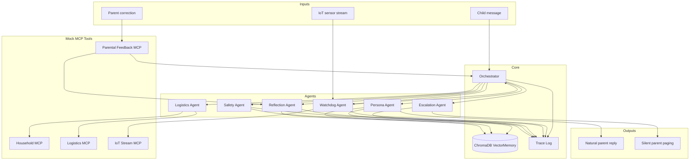
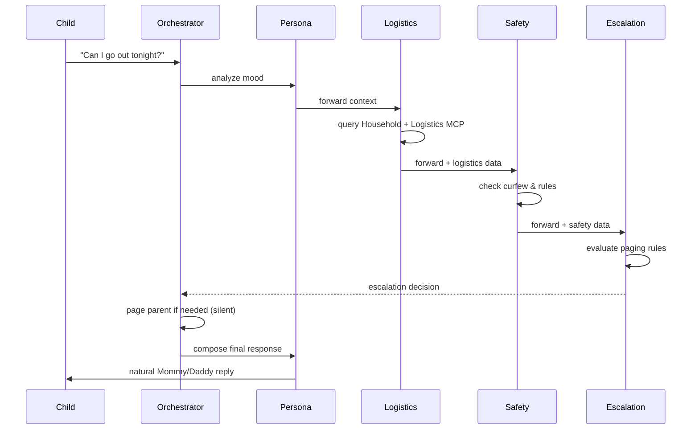
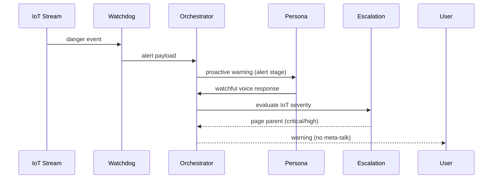
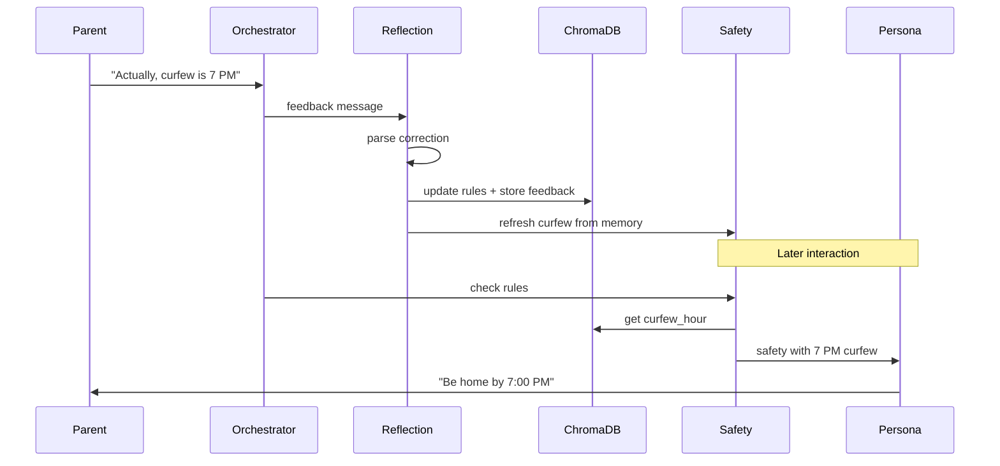

# Architecture — Project Kinship

## System overview

Project Kinship is a **multi-agent orchestration system** where specialized agents communicate via a structured A2A (Agent-to-Agent) message protocol. An `Orchestrator` coordinates flows; agents never talk directly to the user except through the **Persona** agent.

---

## A2A message protocol

All agents extend a common `Agent` base class and exchange `A2A_Message` objects:

| Field | Purpose |
|-------|---------|
| `sender` / `receiver` | Routing |
| `content` | User text or agent output |
| `thought` | Chain-of-thought (logged) |
| `action` | What the agent did (logged) |
| `context` | Pipeline state (`stage`, `safety`, `logistics`, etc.) |

The `context` dict carries state across the pipeline without global variables.

---

## Phase 2 — Hero flow

---

## Phase 3 — Proactive Watchdog

**Danger events:** front door, stove unattended, smoke, window after hours, garage/exit motion.

---

## Phase 4 — Memory & self-learning

**ChromaDB collections:**
- `personality_vectors` — learned rules (curfew, nicknames, vibe)
- `parental_feedback` — semantic search over past corrections

---

## Escalation grounding rules

The **Escalation Agent** decides paging independently of persona speech.

| Category | Example signals | Default urgency | Pages? |
|----------|-----------------|-----------------|--------|
| `going_out` | friends, hang out, leave | medium | Yes |
| `danger` | hurt, fire, help me | critical | Yes |
| `hazard` | gas leak, smoke, stove | high | Yes |
| `theft` | burglar, stole, break in | high | Yes |
| `anxious` | panic, freaking out | medium–high | Yes |
| `urgency` | right now, ASAP, 911 | high | Yes |
| IoT alert | smoke_detected, etc. | by severity | Yes |

Paging is logged to the trace file and shown in the dashboard as a system chip — never spoken to the child.

---

## Mock MCP servers

MCP (Model Context Protocol) tools are simulated as plain Python classes:

| Server | Methods |
|--------|---------|
| `HouseholdMCP` | meals, groceries, laundry |
| `LogisticsMCP` | work calendar, traffic |
| `IoTStreamMCP` | poll events, simulate danger |
| `ParentalFeedbackMCP` | submit_correction |

Phase 1 routes keyword queries directly to these tools without agents.

---

## Trace logging

`core/logger.py` → `trace_log(agent, thought, action, result)`

- Written to `logs/trace.log`
- Parsed by `core/trace_viewer.py` for the dashboard
- In-memory `trace[]` lists returned with every orchestrator flow

This is the **quality evidence** layer: every decision is auditable.

---

## Technology stack

| Layer | Choice |
|-------|--------|
| Language | Python 3.11+ |
| Agent messages | Pydantic models |
| Vector memory | ChromaDB (persistent) |
| Demo UI | Streamlit |
| LLM | Not required (rule/template-based); OpenAI deps reserved for future |

---

## Extension points

1. **LLM integration** — Swap template responses in Persona/Reflection for LangChain + OpenAI
2. **Real MCP** — Replace mock servers with live household APIs
3. **Parent paging** — Wire Escalation output to SMS/push notification service
4. **Auth** — Parent vs child roles in dashboard
